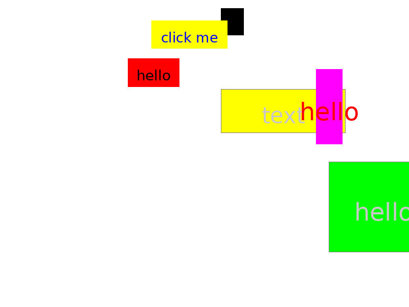
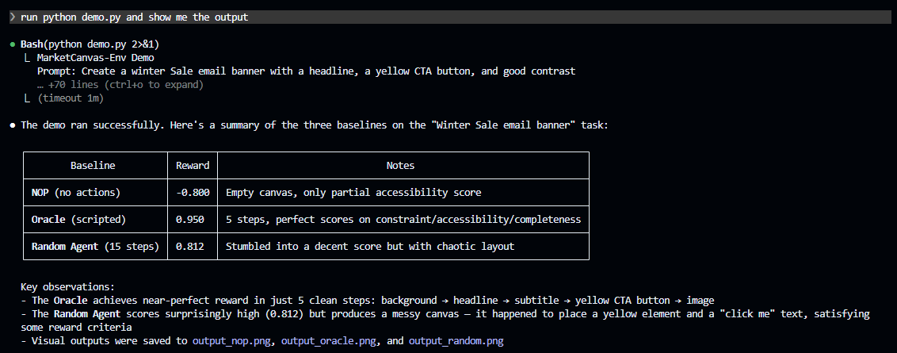
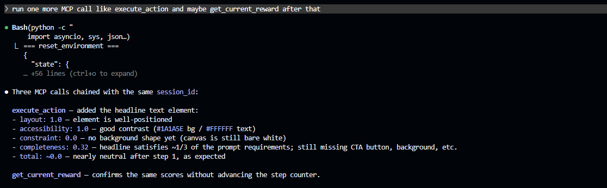
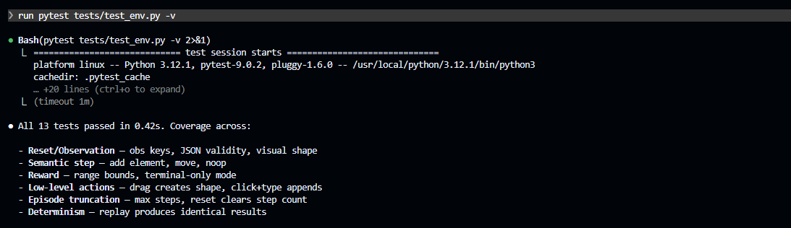

# MarketCanvas-Env

A minimalist 2D design canvas RL environment with MCP server interface. Simulates a "Mini-Canva" where agents create marketing assets, scored by a 4-component reward function (constraint satisfaction, layout quality, WCAG accessibility, completeness).

## Setup

```bash
pip install -e .
```

## Quick Start

```bash
python demo.py
python demo.py --prompt "Create a Black Friday banner with a red CTA" --random-steps 20
```

This runs three baselines against the prompt *"Create a Summer Sale email banner with a headline, a yellow CTA button, and good contrast"*:

| Baseline | Expected Reward | Description |
|----------|----------------|-------------|
| NOP | ~-0.8 | Zero actions, blank canvas |
| Oracle | ~+0.95 | Scripted reference policy |
| Random | Varies by seed; can be positive | 15 random actions |

## Demo Output

The demo script saves example renders in the project root:

### Oracle Output


### Random Output



### NOP Output


## MCP Server

```bash
python -m marketcanvas.mcp_server
```

Exposes tools: `reset_environment`, `get_canvas_state`, `execute_action`, `get_current_reward`, `render_canvas`.

## MCP / Claude Desktop Validation

I also validated the MCP integration from Claude Desktop (in addition to local in-process calls):

- `reset_environment` with a prompt
- `execute_action` in the same `session_id`
- `get_current_reward` to confirm reward consistency without advancing steps
- `render_canvas` for visual sanity checks

Verification summary:

- Verified `reset_environment` with prompt `"Create a Winter Sale banner"`; received a fresh `session_id` and initialized empty 800x600 canvas state.
- Verified `execute_action` + `get_current_reward` consistency in the same session (same reward breakdown when no additional step is taken).
- Verified `pytest tests/test_env.py -v` passes (13/13).

Screenshots from the Claude Desktop MCP run were captured during validation and can be shared with the submission package.

### Claude Desktop MCP Screenshots





### Test Run Screenshot



## Gymnasium Usage

```python
from marketcanvas import MarketCanvasEnv

env = MarketCanvasEnv()
obs, info = env.reset(options={"prompt": "Create a banner with a headline and CTA button"})

# Semantic JSON state is part of the observation now.
print(obs["state_json"])

obs, reward, terminated, truncated, info = env.step_semantic(
    "add_element",
    type="text", content="Summer Sale",
    x=200, y=50, width=400, height=60,
    color="#1A1A5E", text_color="#FFFFFF",
)
```

## Tests

```bash
python -m pytest tests/ -v
```

The test suite covers observation contract validation, semantic and low-level actions, reward bounds, terminal-only reward mode, episode truncation, and deterministic replay.

## Project Structure

```
src/marketcanvas/
├── elements.py        # Element types and data model
├── canvas.py          # Core canvas engine (CRUD)
├── contrast.py        # WCAG 2.0 contrast (from scratch)
├── spatial.py         # Spatial relationship computation
├── prompt_parser.py   # Target prompt → constraints
├── reward.py          # 4-component reward function
├── renderer.py        # PIL rendering to PNG/array
├── environment.py     # Gymnasium env wrapper
└── mcp_server.py      # FastMCP server
tests/
└── test_env.py        # 13 pytest tests
```
